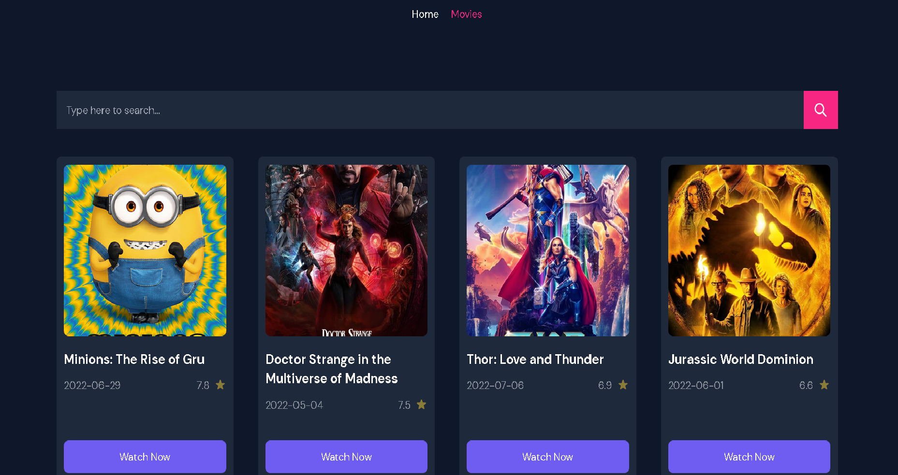
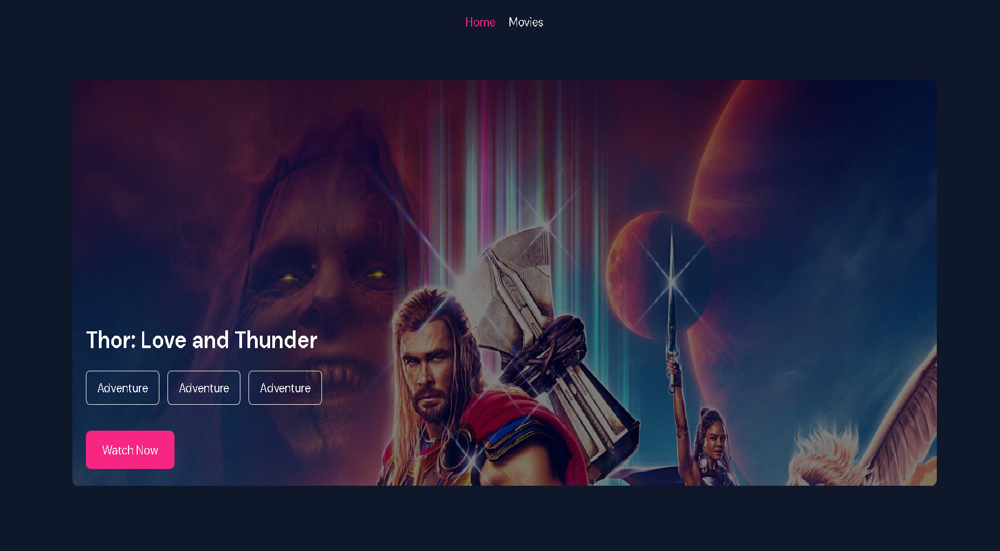
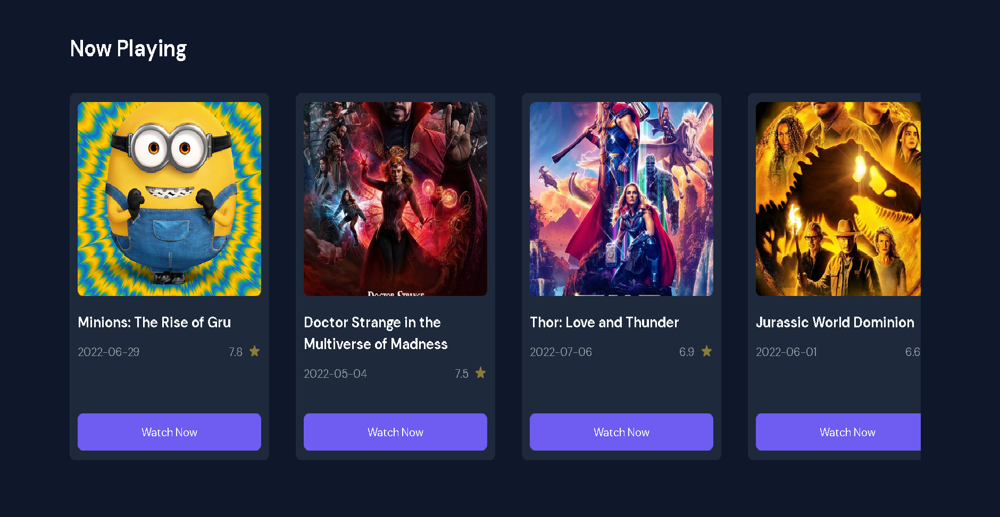
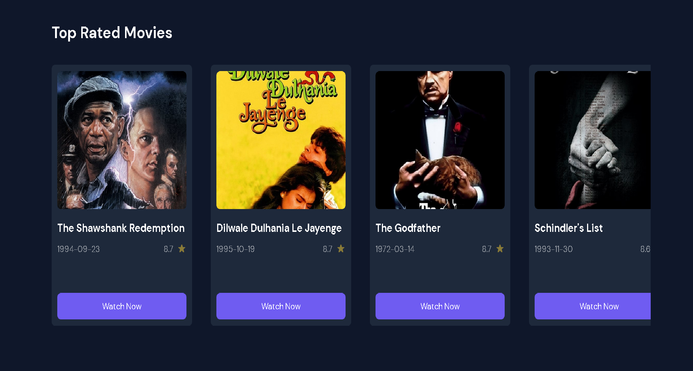
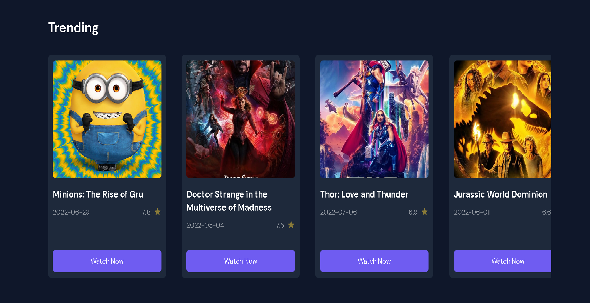
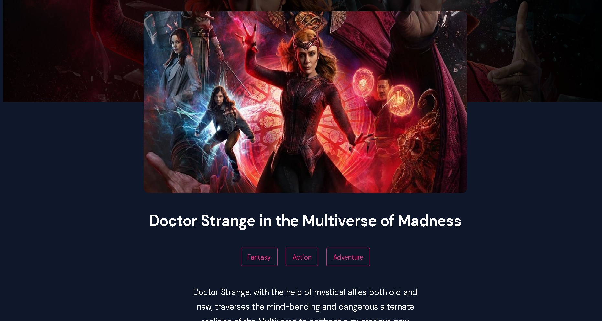

# PROJECT REACT MOVIE APP

## 💡 Introduction

I built a movie application with React JS. The app helps you search for a movie, read information about a movie and check the rating.

## ⚙️ Technology

Project is created with:

- Context API
- React Hooks
- React Router Dom
- The movie Database(TMDB) API

## ⚙️ Setup

`$ cd ../react-simple-movies`
 
`$ npm install`
 
`$ npm start`

## 🌿 Preview images

 

&nbsp;

&nbsp;

&nbsp;

&nbsp;

&nbsp;

 

## 📍 License & copyright

© Thiep Ngo
